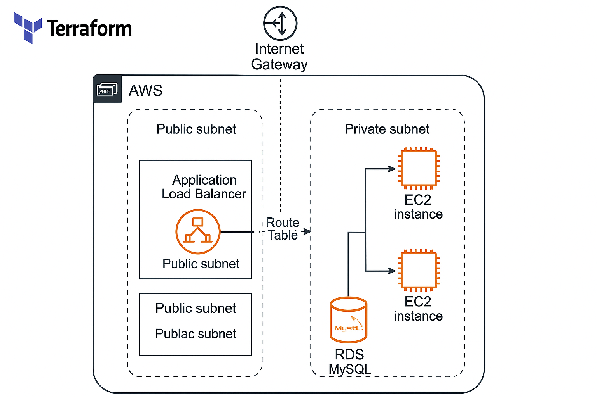

# 🏗️ Two-Tier AWS Infrastructure using Terraform

This Terraform project provisions a two-tier AWS architecture with a VPC, public/private subnets, an Application Load Balancer (ALB), EC2 application instances, and an RDS MySQL database.
The design follows best practices for network segmentation, scalability, and security.


## 🌍 Architecture Overview

The infrastructure consists of:
VPC – Custom virtual private cloud with DNS support enabled.

Public Subnets – Host load balancer and allow inbound traffic from the internet.

Private Subnets – Host application servers and the database (isolated from the public internet).

Security Groups – Enforce tier-to-tier communication rules.

Application Load Balancer (ALB) – Distributes web traffic across application instances.

EC2 Instances – Application servers deployed in multiple Availability Zones.

RDS (MySQL) – Managed relational database hosted in private subnets.

## 📂 Repository Structure
```text
terraform_project/              ← main folder name (your repo)
├── provider.tf                 ← defines AWS provider settings
├── vpc.tf                      ← creates the VPC
├── subnets.tf                  ← creates public/private subnets & DB subnet group
├── security_groups.tf          ← defines security rules between tiers
├── variables.tf                ← input variables for Terraform
├── instances.tf                ← EC2 + RDS resource definitions
├── output.tf                   ← prints outputs (like ALB DNS)
├── userdata.sh                 ← script that installs Apache on EC2

```

## ⚙️ Features

### ✅ Modular & Scalable Design
Easily extendable for multiple environments (e.g., dev, stage, prod).

### ✅ Secure Networking
Traffic is allowed only between tiers through security groups.

### ✅ High Availability
Public and private subnets are distributed across multiple AZs.

### ✅ Parameter-Driven
All configuration parameters (AMI, instance type, subnets, etc.) are controlled via variables.

### ✅ Automated Deployment
EC2 instances use user_data.sh for automatic package installation and startup configuration.

🔧 Prerequisites

### Before deploying, ensure you have:

- AWS credentials configured (via AWS CLI or environment variables)
- SSH key pair created in your AWS account (matches the key_name variable)

## 🚀 Deployment Steps
### 1️⃣ Clone the repository
```text
git clone https://github.com/andrewferdinandus/terraform_project.git
cd terraform_project
```

### 2️⃣ Initialize Terraform
```text
terraform init
```

### 3️⃣ Validate configuration
```test
terraform validate
```

### 4️⃣ Review the plan and it will promt for the db password
```text
terraform plan
```

### 5️⃣ Apply changes and it will promt for the db password
```text
terraform apply
```

Confirm with yes when prompted.

### 🔐 Security Group Rules Summary (I have used both ports in LBR, use one according to your requirement
| Security Group | Description           | Inbound                                | Outbound |
| -------------- | --------------------- | -------------------------------------- | -------- |
| **LBR**        | ALB security group    | 80, 443 from 0.0.0.0/0                 | All      |
| **App**        | Application server SG | 80, 443 from LBR SG; 22 (SSH) optional | All      |
| **DB**         | Database SG           | 3306 from App SG                       | All      |


### 🧩 Variables
| Variable               | Description                                  | Default                          |
| ---------------------- | -------------------------------------------- | -------------------------------- |
| `region`               | AWS Region                                   | `us-east-1`                      |
| `vpc_cidr_block`       | VPC CIDR range                               | `10.0.0.0/16`                    |
| `public_subnet_cidrs`  | List of public subnet CIDRs                  | `["10.0.1.0/24", "10.0.2.0/24"]` |
| `private_subnet_cidrs` | List of private subnet CIDRs                 | `["10.0.3.0/24", "10.0.4.0/24"]` |
| `azs`                  | Availability Zones                           | `["us-east-1a", "us-east-1b"]`   |
| `instance_cfg`         | AMI, instance type, name, SSH key, user data | Object                           |
| `app_lb`               | ALB configuration                            | Object                           |
| `db_master_password`   | MySQL root password                          | Sensitive input                  |


### 📤 Outputs
```text
Outputs:
lb_dns_name = "load_balancer_dns_name"
```

### 🧹 Clean Up
When finished testing, destroy all resources to avoid ongoing AWS costs:
```text
terraform destroy
```

## 👤 Author
**Andrew Ferdinandus** <br>
💻 Senior Linux / Systems Engineer <br>
📍 New Zealand <br>
🔗 [GitHub Profile](https://github.com/andrewferdinandus)  |  [LinkedIn](https://www.linkedin.com/in/andrew-ferdinandus/)

